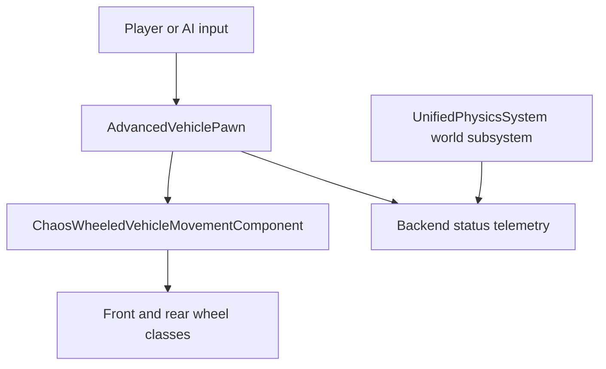

# Architecture and ownership

## Current runtime path

- `AdvancedVehiclePawn` owns input, camera, speed-sensitive steering, approximate fuel and telemetry.
- `UAdvancedFrontWheel` and `UAdvancedRearWheel` hold editable axle defaults. Chaos Vehicles owns the wheel contacts, powertrain and suspension simulation.
- The upstream `BDFRPhysicsCore` owns its backend registry and world subsystem. DriveCore reads the selected backend type but does not route vehicle force integration through it yet.

## Dependency boundary

`BDFR_UnifiedPhysicsSystem` is tracked as a pinned Git submodule, rather than copied into DriveCore. DriveCore declares the plugin in `.uproject` and its public core module in `BDFR_DriveCore.Build.cs`. New upstream commits are proposed by Dependabot; merge them after compatibility review. Changes to the plugin's public API can require edits in DriveCore.

For a future Bullet or Hybrid vehicle mode, provide an explicit vehicle adapter that owns the vehicle simulation for that mode. Define who integrates the chassis, handles wheel-ground contacts and writes transforms. **Do not run the Chaos vehicle and a second solver as independent dynamic owners of the same chassis.** Define data conversion, fixed-step timing and contact ownership before adding a backend selector to the car.

For future mesh deformation or damage, the upstream plugin's normalized impact event can be consumed once that event pipeline exists. DriveCore would map vehicle materials and damage zones to the deformation service. A roadmap entry or enum value alone is not a working deformation feature.

## Validation path

1. Build the selected Unreal version with the pinned submodule and resolve C++/UHT errors.
2. Test level: verify four wheel contacts, acceleration, braking, reverse, reset and steering over several speeds.
3. Compare dry and reduced-grip surfaces using wheel status telemetry and reproducible input traces.
4. When adding a physics backend, test ownership, collision contacts, determinism where claimed, and performance on each declared platform.

No Unreal runtime or assets were available for the initial source snapshot; these checks remain open.
